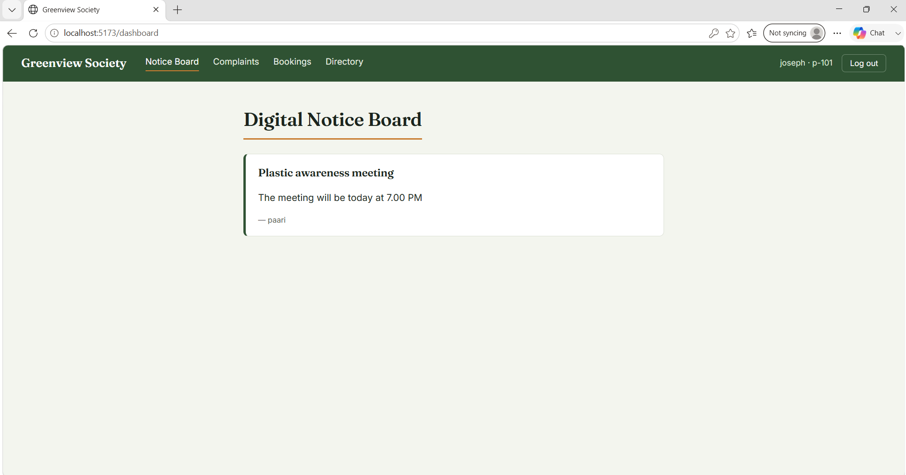

# Greenview Society — Community Management App

A residential society/community management web app built for the Horizon
Broadband technical assignment.

## Project Overview

Greenview Society lets residents and committee admins communicate and
coordinate day-to-day society life: announcements, complaints, facility
bookings, and a member directory — with role-based access (Resident vs Admin).

## Features Implemented

- **Login / Registration** — Firebase Authentication (email/password), with
  role selection (Resident or Admin) captured at signup.
- **Digital Notice Board** — Admins post announcements; all residents see
  them in real time (Firestore live listener).
- **Complaint / Service Request Management** — Residents raise complaints
  with a category; admins triage and update status (Open → In Progress →
  Resolved). Residents only see their own complaints; admins see all.
- **Facility Booking** — Residents book a time slot for shared facilities
  (clubhouse, gym, pool, etc.) with basic double-booking prevention.
- **Member Directory** — Searchable list of residents by name or flat number.

Each screen handles **loading, empty, and error states** explicitly rather
than assuming the happy path.

## Technology Stack

- React 18 + Vite
- React Router v6
- Firebase Authentication + Cloud Firestore
- Plain CSS (design tokens in `src/index.css`) — no UI framework, for full
  control over the design system

## Architecture

Layered / separation-of-concerns structure:

```
src/
  firebase.js          # Firebase app initialization (single source of truth)
  context/
    AuthContext.jsx    # Global auth + user profile/role state
  services/            # All Firestore reads/writes live here — screens never
    announcements.js   # talk to Firestore directly
    complaints.js
    bookings.js
    directory.js
  components/
    Navbar.jsx
    ProtectedRoute.jsx # Route guard, optional role restriction
    StateViews.jsx     # Shared Loader / EmptyState / ErrorState
  pages/
    Login.jsx, Register.jsx
    Announcements.jsx, Complaints.jsx, Bookings.jsx, Directory.jsx
  App.jsx              # Route definitions
  main.jsx             # Entry point
```

This keeps Firebase calls out of components (a "service layer"), so UI
components stay focused on rendering + local form state, and the data layer
can be swapped or mocked independently.

## Setup Instructions

1. **Clone and install**
   ```bash
   git clone <your-repo-url>
   cd society-app
   npm install
   ```

2. **Create a Firebase project**
   - Go to [Firebase Console](https://console.firebase.google.com) → Add project
   - Enable **Authentication → Email/Password**
   - Enable **Firestore Database** (start in test mode, then apply
     `firestore.rules` from this repo before going live)

3. **Add your Firebase config**
   Open `src/firebase.js` and replace the placeholder `firebaseConfig` object
   with your project's config (Project Settings → General → Your apps → SDK
   config).

4. **Run locally**
   ```bash
   npm run dev
   ```
   App runs at `http://localhost:5173`

5. **Build for production**
   ```bash
   npm run build
   ```

## Application Flow

1. New user registers → chooses Resident or Admin → profile stored in
   `users/{uid}` in Firestore.
2. On login, `AuthContext` loads the user's profile and role, gating routes
   via `ProtectedRoute`.
3. Residents can post complaints and bookings tied to their flat number;
   admins get extra controls (posting announcements, updating complaint
   status, seeing all complaints).
4. All lists (announcements, complaints, bookings) use Firestore's
   `onSnapshot` for live updates — no manual refresh needed.

## Known Limitations

- No image/file uploads (e.g., photo evidence for complaints).
- Facility booking does not yet support cancellation.
- No push/email notifications — updates are only visible in-app.
- Firestore security rules are a baseline; production use would need field
  validation rules too.

## Future Improvements

- Push notifications for complaint status changes.
- Admin analytics (complaint volume by category, booking utilization).
- Visitor management and emergency contacts modules.
- Unit/integration tests for the service layer.

## Screenshots
## Screenshots

### Login


### Register


### Digital Notice Board


### Complaints


### Facility Booking


### Member Directory

# society-app
