# Greenview Society — Community Management App

A residential society/community management web app built for the Horizon
Broadband technical assignment.

## Project Overview

Greenview Society lets residents and committee admins communicate and
coordinate day-to-day society life: announcements, complaints, facility
bookings, and a member directory — with role-based access (Resident vs Admin).

## Features Implemented

- **Login / Registration** — Firebase Authentication (email/password + Google
  Sign-In), with role selection (Resident, Admin, or Security Staff) at
  signup. Email verification is required before first login; Google
  Sign-In only works for already-registered emails.
- **Digital Notice Board** — Admins post announcements; all residents see
  them in real time. Dashboard also shows a welcome banner with quick
  stats (announcements, open complaints, upcoming bookings).
- **Events & Meetings** — Admins schedule society events/meetings with
  date, time, and location; residents RSVP to confirm attendance.
- **Complaint / Service Request Management** — Residents raise complaints
  by category; admins triage and update status (Open → In Progress →
  Resolved). Residents can delete their own complaint once resolved.
- **Maintenance Payment Tracking** — Admins record maintenance dues per
  flat per month; residents view their own payment status; admins mark
  payments as Paid.
- **Visitor Management** — Residents log expected visitors; admins and
  security staff view and update visitor status (Expected → Checked In →
  Checked Out).
- **Emergency Contacts** — Admin-maintained directory of emergency
  numbers (police, fire, security, etc.), one-tap call links for
  residents.
- **Facility Booking** — Residents book shared facility time slots with
  basic double-booking prevention.
- **Polls & Surveys** — Admins create polls with multiple options;
  residents vote once (enforced via a Firestore transaction) and see
  live results as percentage bars.
- **Community Discussions** — Any member can start a discussion thread
  and reply to others' threads.
- **Buy / Sell / Rent Marketplace** — Residents post listings to buy,
  sell, or rent items, with contact info; filterable by listing type.
- **Society Member Directory** — Searchable list of residents with
  avatar initials, flat number, and role.
- **Profile Management** — Residents can update their own name and flat
  number.
- **Resident / Admin / Security Roles** — Role-based access throughout:
  admins manage announcements/payments/events, security staff manage
  visitor check-in/out alongside admins, residents get resident-scoped
  views.
- **In-app Notifications** — A notification bell shows unread
  announcement counts since the user's last visit.

Each screen handles **loading, empty, and error states** explicitly.


## Technology Stack

- React 18 + Vite
- React Router v6
- Firebase Authentication (Email/Password + Google Sign-In) + Cloud Firestore
- Plain CSS (design tokens in `src/index.css`) — glassmorphism, gradients,
  and motion, no UI framework

## Architecture

Layered / separation-of-concerns structure:

```
src/
  firebase.js          # Firebase app initialization (single source of truth)
  context/
    AuthContext.jsx    # Global auth + user profile/role state
  services/            # All Firestore reads/writes live here — screens never
    announcements.js   # talk to Firestore directly
    complaints.js
    bookings.js
    directory.js
    polls.js,
    profile.js,
    emergencyContacts.js, 
    events.js,
    payments.js, 
    visitors.js, 
    discussions.js, 
    marketplace.js
  components/
    Navbar.jsx
    ProtectedRoute.jsx # Route guard, optional role restriction
    StateViews.jsx     # Shared Loader / EmptyState / ErrorState
    pages/
    Login.jsx, Register.jsx
    Announcements.jsx       # Digital Notice Board + dashboard stats
    Events.jsx              # Events & Meetings with RSVP
    Complaints.jsx          # Complaint management
    Payments.jsx            # Maintenance payment tracking
    Visitors.jsx            # Visitor management
    EmergencyContacts.jsx   # Emergency contacts directory
    Bookings.jsx            # Facility booking
    Polls.jsx               # Polls & surveys
    Discussions.jsx         # Community discussions
    Marketplace.jsx         # Buy/Sell/Rent listings
    Directory.jsx           # Member directory
    Profile.jsx             # Profile management
    
  App.jsx              # Route definitions
  main.jsx             # Entry point
```

This keeps Firebase calls out of components (a "service layer"), so UI
components stay focused on rendering + local form state, and the data layer
can be swapped or mocked independently.

## Setup Instructions

1. **Clone and install**
   ```bash
   git clone <your-repo-url>
   cd society-app
   npm install
   ```

2. **Create a Firebase project**
   - Go to [Firebase Console](https://console.firebase.google.com) → Add project
   - Enable **Authentication → Email/Password**
   - Enable **Firestore Database** (start in test mode, then apply
     `firestore.rules` from this repo before going live)

3. **Add your Firebase config**
   Open `src/firebase.js` and replace the placeholder `firebaseConfig` object
   with your project's config (Project Settings → General → Your apps → SDK
   config).

4. **Run locally**
   ```bash
   npm run dev
   ```
   App runs at `http://localhost:5173`

5. **Build for production**
   ```bash
   npm run build
   ```

## Application Flow

1. New user registers → chooses Resident or Admin → profile stored in
   `users/{uid}` in Firestore.
2. On login, `AuthContext` loads the user's profile and role, gating routes
   via `ProtectedRoute`.
3. Residents can post complaints and bookings tied to their flat number;
   admins get extra controls (posting announcements, updating complaint
   status, seeing all complaints).
4. All lists (announcements, complaints, bookings) use Firestore's
   `onSnapshot` for live updates — no manual refresh needed.

## Known Limitations

- No image/file uploads (e.g., photo evidence for complaints).
- Facility booking does not yet support cancellation.
- No push/email notifications — updates are only visible in-app.
- Firestore security rules are a baseline; production use would need field
  validation rules too.

## Future Improvements

- Push notifications for complaint status changes.
- Admin analytics (complaint volume by category, booking utilization).
- Visitor management and emergency contacts modules.
- Unit/integration tests for the service layer.

## Screenshots

### Login
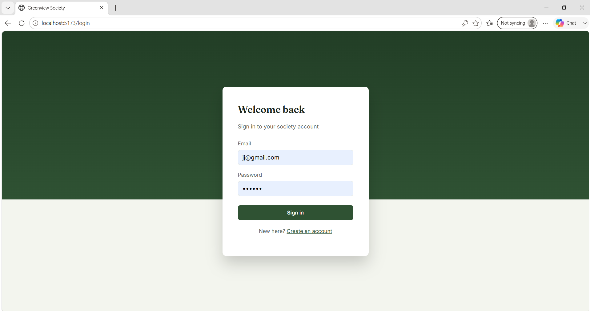

### Register
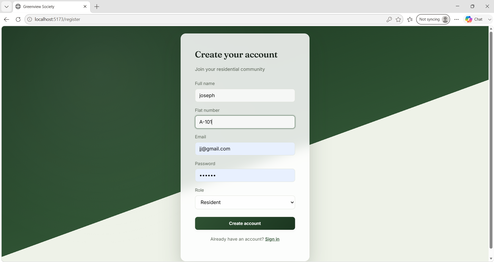

### Digital Notice Board (Dashboard)
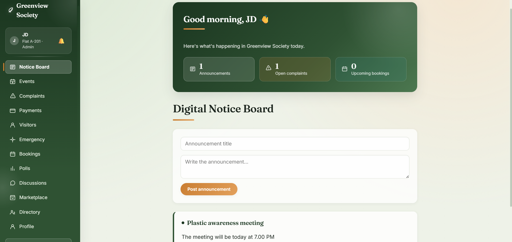

### Events & Meetings
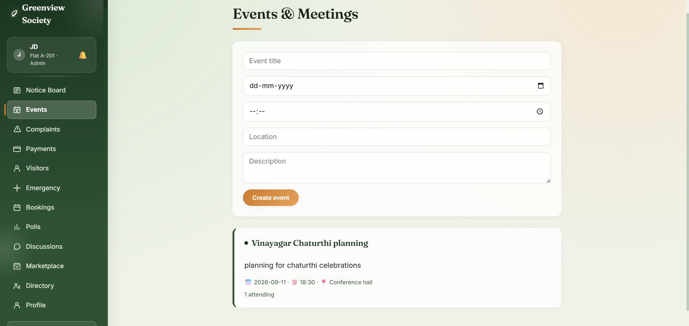

### Complaints & Service Requests
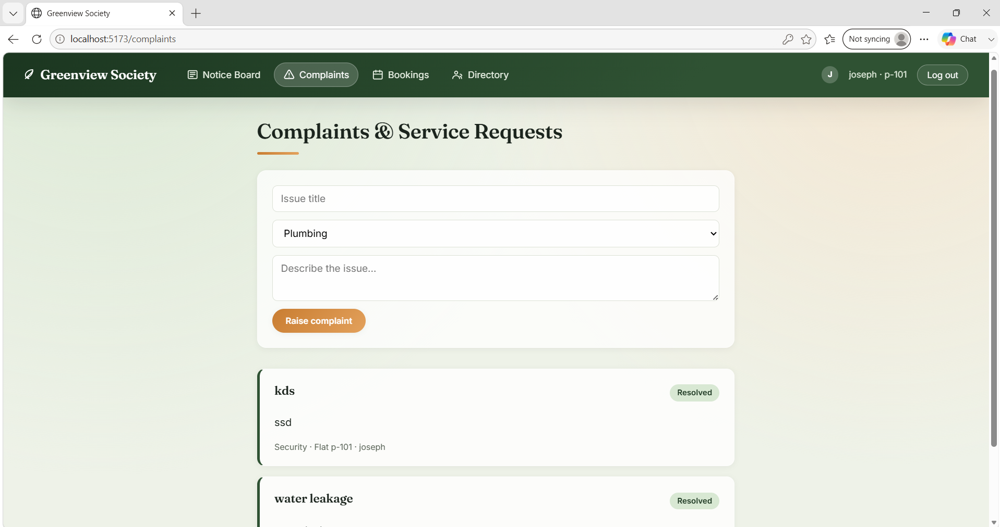

### Maintenance Payments
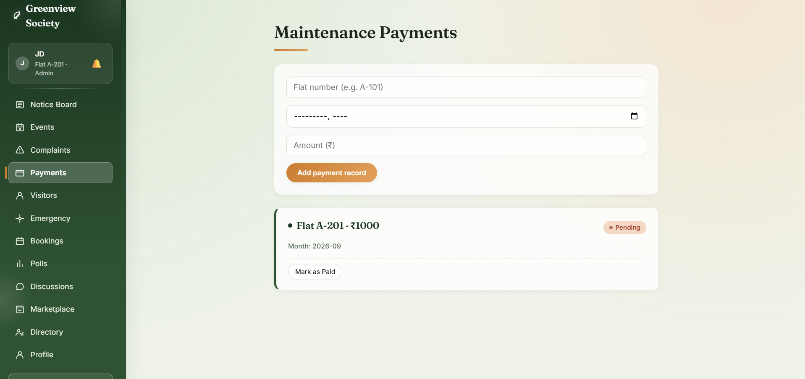

### Visitor Management
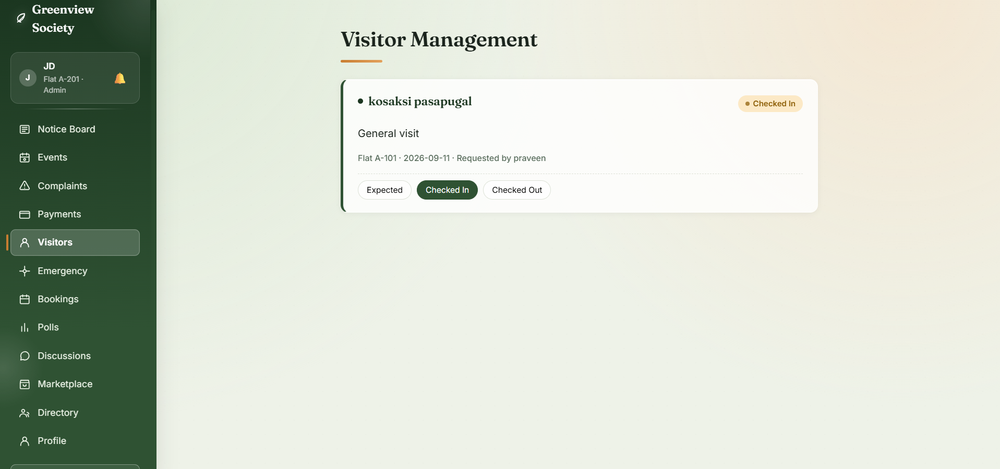

### Emergency Contacts
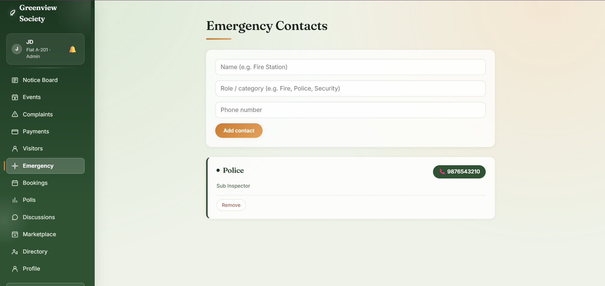

### Facility Booking
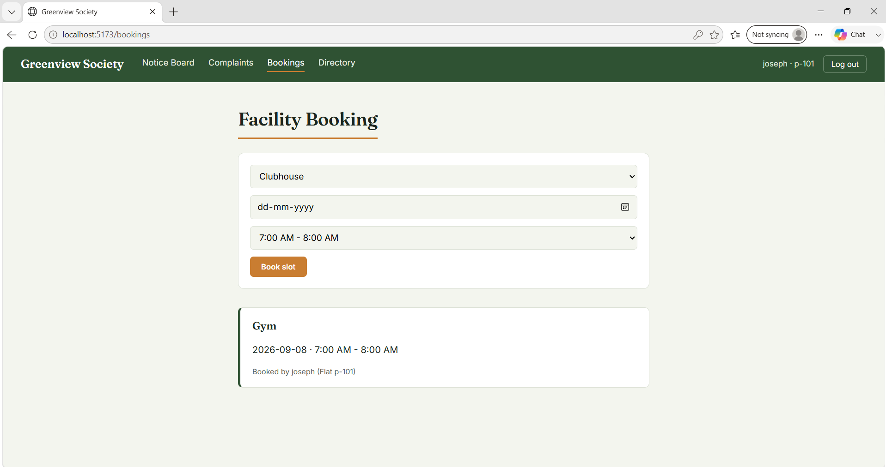

### Polls & Surveys
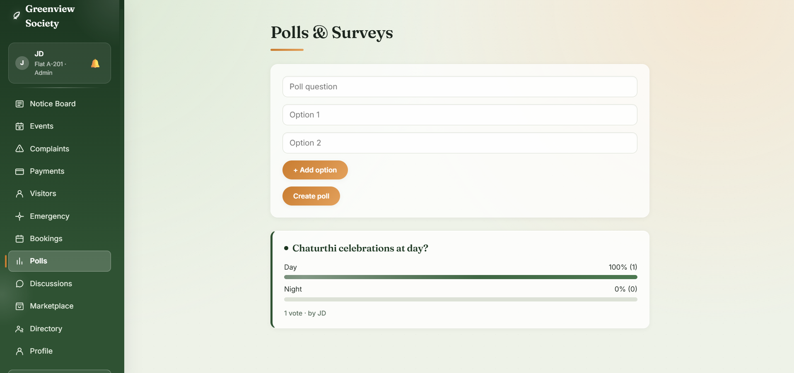

### Community Discussions
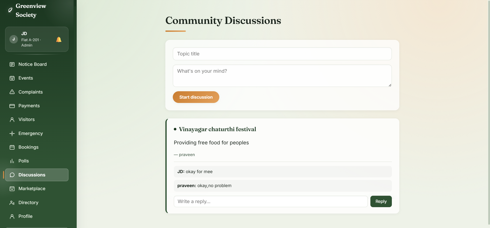

### Buy / Sell / Rent Marketplace
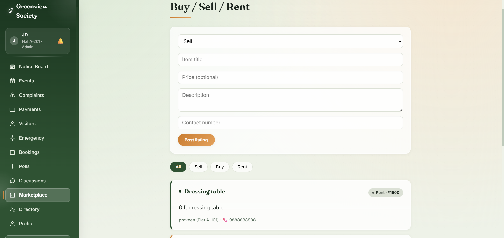

### Member Directory
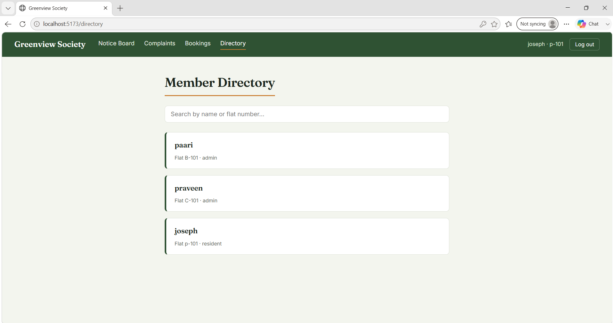

### Profile Management
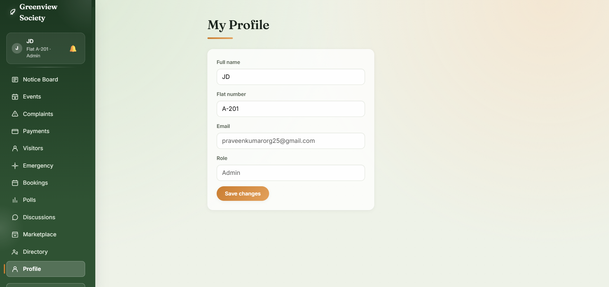